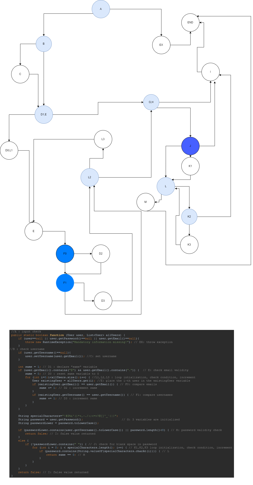

### Luka Radulovikj, 216028

Цикломатската комплексност е еднаква на бројот на предикатни јазли + 1, односно 10+1 = 11
### Every Branch Testiranje
| Branch     | Test case 1 | Test case 2 | Test case 3 | Test case 4 | Test case 5 | Test case 6|
|------------|:-----------:|------------:|-------------|------------|-------------|------------|
| A-EX       |      ✓      |             |             |            |             |            |
| A-B        |             |      ✓       |    ✓         | ✓          | ✓            |   ✓         |
| B-C        |             |             |             |            |             |      ✓      |
| C-D1,E     |             |             |             |            |             |   ✓         |
| B-D1,E     |             |     ✓        |     ✓        | ✓          |  ✓           |            |
| D1,E-D0,L1 |             |     ✓        |  ✓           | ✓          |   ✓          |     ✓       |
| D0,L1-X    |             |             |             |            |   ✓          |       ✓     |
| X-F0       |             |             |             |            |  ✓           |      ✓      |
| F0-F1      |             |             |             |            |    ✓         |       ✓     |
| F0-D2      |             |             |             |            |   ✓          |            |
| D2-F1      |             |             |             |            |   ✓          |            || col 2 is      |   centered    |             $12 |             |             |             |            |
| F1-D3      |             |             |             |            |   ✓          |            |
| F1-L2      |             |             |             |            |    ✓         |    ✓        |
| D3-L2      |             |             |             |            |   ✓          |            |
| L2-L3      |             |             |             |            |    ✓         |      ✓      |
| L3-X       |             |             |             |            |   ✓          |      ✓      |
| D1,E-G,H   |             |    ✓         | ✓            | ✓          |             |            |
| L2-G,H     |             |             |             |            |   ✓          |     ✓       |
| M-END      |             |             |             | ✓          |             |      ✓      |
| K3-L       |             |             |             |            |             |            |
| L-M        |             |             |             | ✓          |             |    ✓        |
| L-K2       |             |             |             | ✓          |    ✓         |            |
| K2-K3      |             |             |             | ✓          |             |            |
| K2-I       |             |             |             |            |     ✓        |            |
| K1-L       |             |             |             | ✓          |    ✓         |     ✓       |
| G,H-J      |             |             |   ✓          | ✓          |    ✓         |          ✓  |
| J-K1       |             |             |             | ✓          |   ✓          |     ✓       |
| J-I        |             |    ✓         |    ✓         |            |             |            |
| G,H-I      |             |             |             |            |             |            |
| I-END      |             |   ✓          |  ✓           |            |  ✓           |            |
| EX-END     |      ✓      |             |             |            |             |            |

### Multiple Condition Testiranje
Ќе ги пробаме сите можности. Едната е сите услови да се исполнети, односно да имаме null корисник. 
Друга можност е да е null e-mail адресата, и трета е да е null лозинката. 
Последната можност е да немаме null вредности, но тоа е веќе покриено во Every Branch тестот. 